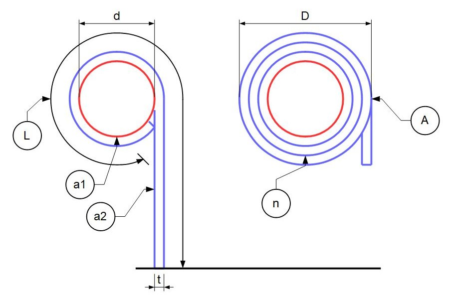

## Coil Diameter & Turns Calculation

### Legend

| Symbol | Definition                                                                 |
| :----- | :------------------------------------------------------------------------- |
| L      | curtain height/length. A good approximation is to use height to top of box |
| t      | lath thickness                                                             |
| d      | axle diameter                                                              |
| a1     | axle area                                                                  |
| a2     | effective side area of curtain                                             |
| D      | overall coil diameter                                                      |
| A      | total side area                                                            |
| n      | number of turns approximation                                              |
